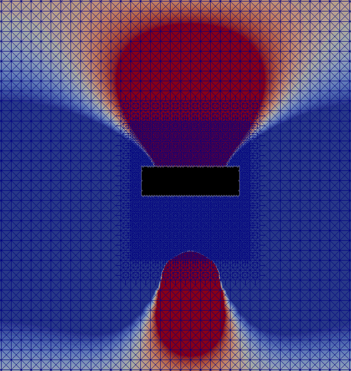

# viscous-flows-of-liquid-helium
I developed a model for moving obstacle in a viscous fluid in this project. 

Pictures of pressure field, velocity magnitude field, and velocity rotation field. (Animations on demand)

